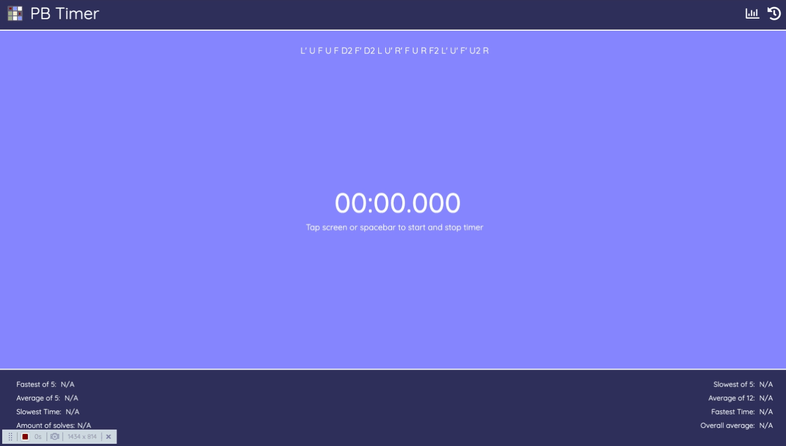

# PB Timer

A Rubik's cube timer built with Vanilla JavaScript.

### Screenshot

### Built with

- HTML
- CSS
- Javascript

### Features

### Potential Future Features

- Adding a log-in feature so tasks can be accessed from different machines.
