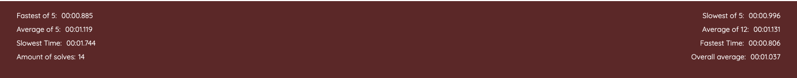

# PB Timer

A Rubik's cube timer built with Vanilla JavaScript.

### Screenshot

### Built with

- HTML
- CSS
- Javascript
- [Chart JS](https://www.chartjs.org/) - A plugin to include graphs on your website.
- [SR-Scrambler](https://www.npmjs.com/package/sr-scrambler) - a plugin which generates scrambles.
- [Statman-Stopwatch](https://www.npmjs.com/package/statman-stopwatch) - a Stopwatch plugin.

### Features

The user can start the timer by either clicking the screen or hitting the space button to begin the timer. Once a time is recorded it can then be viewed alongside previous times by clicking one of the 2 buttons in the upper right-hand corner. The left button will display all previous times in a chart(created with Chart JS) from a time frame specified in the dropdown box, where as the right button will display the times within a table, also giving the option to delete individual times or clear all.

at the bottom of the home screen is a box which displays averages of previous solves and also various other information.

Each time the user is about to start the timer they are presented with a random scramble. If the user isn't happy with the current scramble they can click the scramble to generate a new one. These scrambles are generated via a plug in called [SR-Scrambler](https://www.npmjs.com/package/sr-scrambler).

### Potential Future Features

- I would love to come back and rebuild this project using a framework to make the code more manageable and better organized.
- it would also be great to add a log in feature so times could be accessed on any device.
